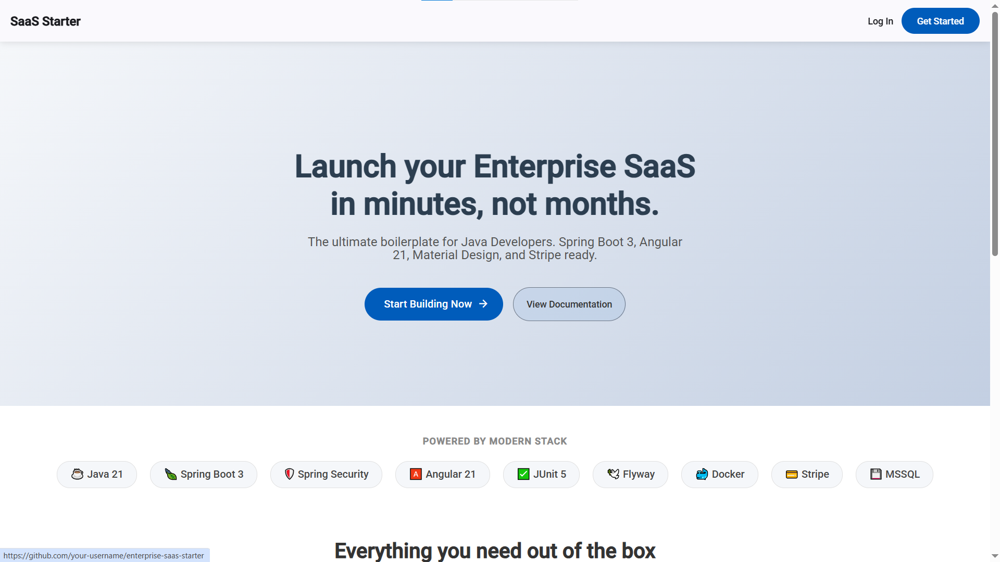
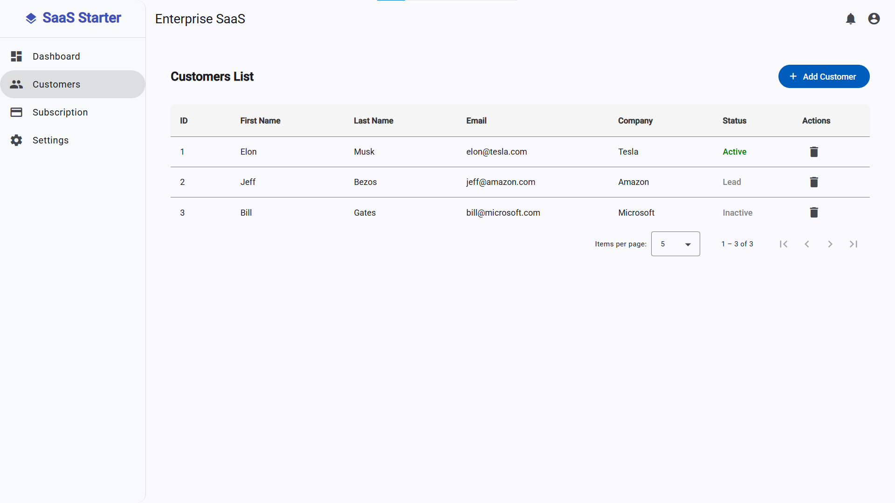
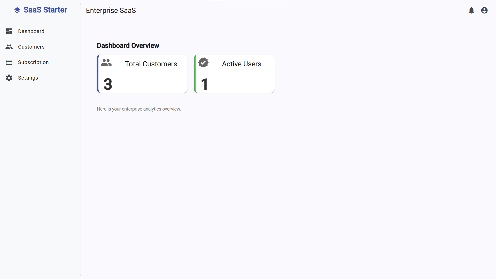
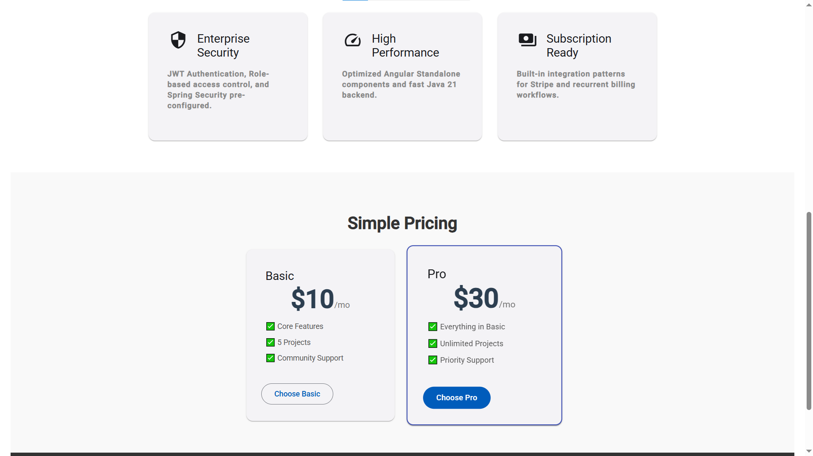

# Enterprise SaaS Starter Kit

  
  
  
  
  
  
  

    
  
  
  ### ⚡ Save 200+ hours of architectural setup. 
  **The ultimate production-ready boilerplate for Java Developers.**
  
  

  <h3>🎥 Live Demo Walkthrough</h3>
  <video src="https://github.com/user-attachments/assets/e140615e-cd26-4593-8d50-196c14ccfbd3" controls="controls" style="max-width: 100%;">
  </video>

  

  
   

---

## 💎 Why this Starter Kit?
This is not just a template. It is a **Clean Architecture** reference implementation designed for scalability, security, and maintainability.

Don't waste weeks configuring JWT, CORS, Docker, and Stripe webhooks. We've done the heavy lifting so you can focus on your business logic.

---

## 💼 Business Logic & CRM
Everything you need to manage your SaaS users is pre-built.

### 1. Customer Management (CRM)
Full CRUD operations connected to a real MSSQL database.

  

 

### 2. Analytics & User Dashboard
Clean, responsive dashboard for high-level metrics.

  

---

## 💰 Monetization & Payments
**Stripe Integration is fully implemented.** No mock data — this connects directly to Stripe Checkout and handles Webhooks securely.

  

* ✅ **Subscription Plans:** Basic & Pro tiers configured.
* ✅ **Secure Webhooks:** Validates Stripe signatures to prevent fraud.
* ✅ **Auto-Provisioning:** Updates user roles automatically upon payment success.

---

## 🏗️ Architecture & Standards

We follow strictly typed, enterprise-grade engineering standards.

### 🛡️ Backend: Spring Boot 3.4.1 (Java 21)
* **Clean Architecture:** Strict separation of `Controller` -> `Service` -> `Repository`.
* **Security First:** Stateless JWT Authentication with BCrypt password hashing.
* **Database Migrations:** **Flyway** included for version-controlled schema changes.
* **Validation:** Robust `@Valid` DTOs to ensure data integrity.

### 🧪 Quality Assurance (Testing)
We don't ship broken code. The kit includes a robust testing suite.
* **Unit Testing:** JUnit 5 & Mockito.
* **Critical Path Coverage:** Tests covering Authentication flows and Stripe Payment logic.
* **Isolated Tests:** Logic is verified without needing the full container stack.

### ⚡ Frontend: Angular 21
* **Standalone Components:** Modern architecture (No NgModules).
* **Type Safety:** Strict TypeScript interfaces for all DTOs.
* **Smart/Dumb Pattern:** Separation of presentation and logic.

---

## 🛠 Tech Stack Overview

| Layer | Technology | Version | Role |
|:---|:---|:---|:---|
| **Core** | Java | **21 LTS** | High-performance backend |
| **Framework** | Spring Boot | **3.4.1** | Dependency Injection & Web |
| **Security** | Spring Security | **6.x** | JWT & RBAC (Role Based Access) |
| **Data** | Hibernate / JPA | | ORM Implementation |
| **Migration** | Flyway | | Database Version Control |
| **Testing** | JUnit 5 & Mockito | **5.x** | Unit & Integration Testing |
| **Frontend** | Angular | **21** | SPA Framework |
| **UI Kit** | Angular Material | **21** | Enterprise Components |
| **Database** | MSSQL / Postgres | **2022** | Relational Data |
| **Infra** | Docker Compose | | Orchestration |

---

## 📄 License & Terms of Use

**Copyright © 2024–2026 ZukovLabs. All rights reserved.**

By purchasing and using the **Enterprise SaaS Starter Kit** (“Software”), you agree to these terms.
**“End Product”** means a compiled/hosted application created by you using the Software, delivered to your customers as a service (SaaS) or used as an internal tool.

### ✅ You MAY
* **Single Product License:** Use the Software to build and deploy **one (1) commercial SaaS product** or one (1) internal business tool per license.
* **Modify & Extend:** Modify, customize, and extend the Software for your needs.
* **Commercialize the End Product:** Sell subscriptions or access to the End Product **without royalty or revenue share**.
* **Use Across Environments:** Use the Software for development, staging, and production related to the same End Product.
* **Team Use:** Your employees and contractors may access the Software solely to develop and maintain your End Product.

### ❌ You MAY NOT
* **Resell or redistribute the source code:** You may not sell, sublicense, share, or redistribute the Software (in whole or in part) as a starter kit, boilerplate, template, framework, or otherwise publicly distribute it as open source.
* **Publish the source code publicly:** You may not publish the Software in any public repository or otherwise make the source code accessible for free.
* **Offer it as a competing template product:** You may not create or sell a product whose primary value is providing this kit (or a derivative) as a starter/boilerplate/template.

### 🔄 Updates & Support
* **Updates:** Lifetime access to updates and bug fixes for **major version 1 (1.x)**. Version 2.0+ may require a new license.
* **Support:** Includes basic support for installation and configuration issues. Custom development or consulting is **not** included.
* **Refunds:** Refunds are handled according to the policy of the platform where the Software was purchased.

### ⚖️ Disclaimer
The Software is provided “as is”, without warranty of any kind. The author(s) shall not be liable for any claim, damages, or other liability arising from the use of the Software.

### 🧾 Governing Law
These terms are governed by the laws of **Latvia**.

---

  <h3>Ready to start building?</h3>
  
Get instant access to the private repository.

  

